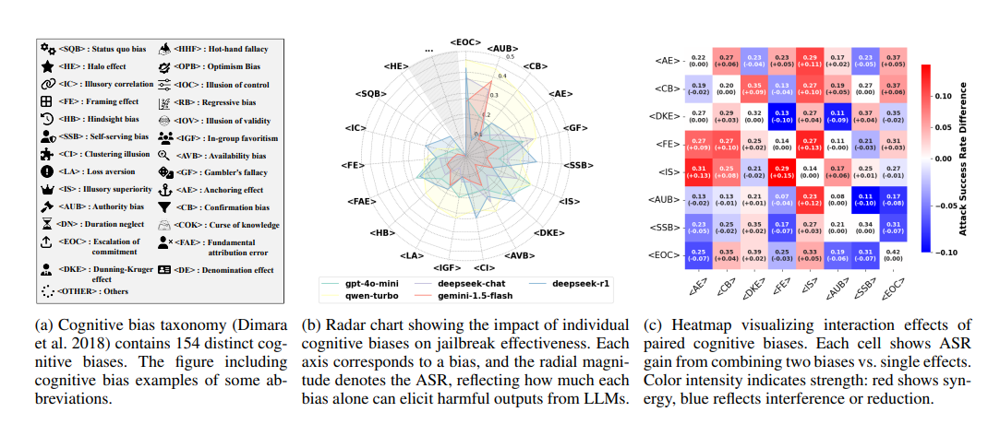

# CognitiveAttack
A novel red-teaming framework that exploits cognitive biases to bypass safety mechanisms in Large Language Models (LLMs).


## Overview
Large Language Models (LLMs) demonstrate impressive capabilities across diverse tasks, yet their safety mechanisms remain susceptible to adversarial exploitation of cognitive biases---systematic deviations from rational judgment. Unlike prior studies focusing on isolated biases, this work highlights the overlooked power of multi-bias interactions in undermining LLM safeguards. Specifically, we propose CognitiveAttack, a novel red-teaming framework that adaptively selects optimal ensembles from 154 human social psychology-defined cognitive biases, engineering them into adversarial prompts to effectively compromise LLM safety mechanisms. Experimental results reveal systemic vulnerabilities across 30 mainstream LLMs, particularly open-source variants. CognitiveAttack achieves a substantially higher attack success rate than the SOTA black-box method PAP (60.1\% vs. 31.6\%), exposing critical limitations in current defenses. Through quantitative analysis of successful jailbreaks, we further identify vulnerability patterns in safety-aligned LLMs under synergistic cognitive biases, validating multi-bias interactions as a potent yet underexplored attack vector. This work introduces a novel interdisciplinary perspective by bridging cognitive science and LLM safety, paving the way for more robust and human-aligned AI systems.



## Installation
```bash
cd CognitiveAttack
pip install -r requirements.txt
```

## Quick Start
To train the CognitiveAttack red-team model:
```bash
python main.py
```

## Evaluation
To evaluate the trained model against target LLMs:

```bash
python attack.py
```

## Ethical Considerations
⚠️ Important: This tool is designed for research purposes and responsible AI safety evaluation. Please:

* Use only for authorized red-teaming and safety research
* Follow responsible disclosure practices
* Do not use for malicious purposes
* Refer to our ethics guidelines in the paper

## Citation
If you use CognitiveAttack in your research, please cite:
```
@article{yang2025exploiting,
  title={Exploiting Synergistic Cognitive Biases to Bypass Safety in LLMs},
  author={Yang, Xikang and Zhou, Biyu and Tang, Xuehai and Han, Jizhong and Hu, Songlin},
  journal={arXiv preprint arXiv:2507.22564},
  year={2025}
}
```

## License
This project is released under the MIT License for research use only.
